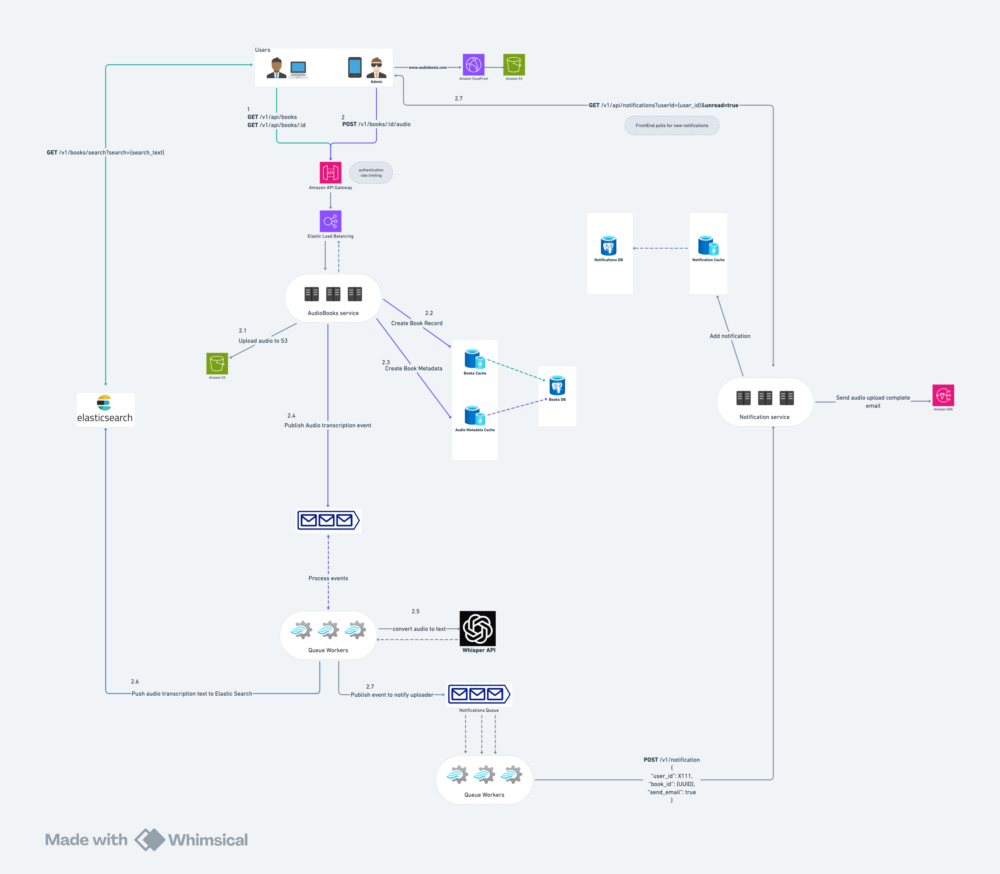

# Audiobook Store Backend

A simple RESTful API backend for an audiobook store, built with Go and Gin.

## Features

- List audiobooks with pagination
- Retrieve audiobook details by UUID
- Upload audio files for audiobooks (admin only)

## Prerequisites

- Go 1.18 or higher
- Docker & Docker Compose (for containerized setup)

## Installation & Setup

1. Clone the repository:

   ```bash
   git clone https://github.com/ilivestrong/audiobook_store.git
   cd audiobook_store
   ```

2. Build the server executable:

   ```bash
   go build -o server .
   ```

3. Run the server locally:

   ```bash
   ./server
   # Server starts on port 8080
   ```

4. (Optional) Start with Docker Compose: (this is unstable for now)

   ```bash
   docker compose up --build
   ```

## API Endpoints

Base URL: `http://localhost:8080/api/v1`

### Public Endpoints

- `GET /books` - List audiobooks

  - Query parameters:
    - `page` (int, default: 1)
    - `size` (int, default: 10)

- `GET /books/:id` - Get audiobook details by UUID

### Admin-Only Endpoint

- `POST /books/:id/upload` - Upload an audio file for an audiobook
  - Form data:
    - `file` - Audio file to upload
    - Provide 'X-User-Role' as 'admin' for successful invocation. Any other role will lead to forbidden error.

## Project Structure

```
├── handlers/      // HTTP handlers
├── middlewares/   // Custom Gin middleware (e.g., AdminOnly)
├── repositories/  // Data access layer
├── router/        // Gin router setup
├── services/      // Business logic layer
├── models/        // Data models
├── main.go        // Application entrypoint
├── go.mod         // Go module definition
└── README.md      // This file
```

## Architecture Diagrams

### System Architecture



### Database ERD


### App Demo

 <video src="audiobooks_store_demo.mp4" controls width="640" />

## License

This project is licensed under the MIT License. See [LICENSE](LICENSE) for details.
